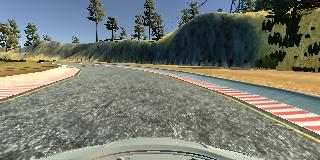
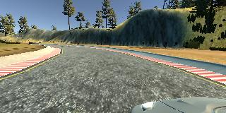
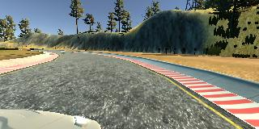
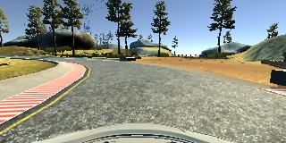
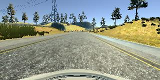
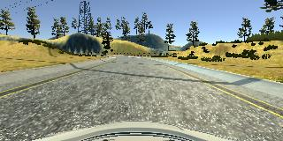
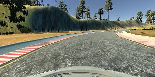
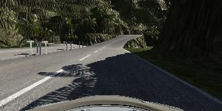

# Behavioral Cloning

---

**Behavioral Cloning Project**

The goals / steps of this project are the following:
* Use the simulator to collect data of good driving behavior
* Build, a convolution neural network in Keras that predicts steering angles from images
* Train and validate the model with a training and validation set
* Test that the model successfully drives around track one without leaving the road
* Summarize the results with a written report

## Rubric Points
### Here I will consider the [rubric points](https://review.udacity.com/#!/rubrics/432/view) individually and describe how I addressed each point in my implementation.  

---
### Files Submitted & Code Quality

#### 1. Submission includes all required files and can be used to run the simulator in autonomous mode

My project includes the following files:
* model.py containing the script to create and train the model
* drive.py for driving the car in autonomous mode
* model.h5 containing a trained convolution neural network
* README.md summarizing the results
* video.mp4 video showing a lap in autonomous mode

#### 2. Submission includes functional code
Using the Udacity provided simulator and my drive.py file, the car can be driven autonomously around the track by executing
```sh
python drive.py model.h5
```

#### 3. Submission code is usable and readable

The model.py file contains the code for training and saving the convolution neural network. The file shows the pipeline I used for training and validating the model, and it contains comments to explain how the code works. The code uses a generator for storing the training data.

### Model Architecture and Training Strategy

#### 1. An appropriate model architecture has been employed

My model consists of a convolution neural network. There are 5 convolutional layers. The first 3 uses a 5x5 kernel with a 2x2 stride. The next 2 uses a 3x3 kernel with no strides. The depths are between 24 and 64 (model.py lines 104-108).

Then the input is flattened before 3 fully connected layers with width 200, 20 and 5. The last layer is our output. After the first fully connected layer dropout is used with drop rate 0.5 (model.py line 111).

The model uses RELU layers to introduce nonlinearity, and the data is normalized in the model using a Keras lambda layer (code line 94).

#### 2. Attempts to reduce overfitting in the model

The model contains a dropout layer in order to reduce overfitting (model.py lines 111).

The model was trained and validated on different data sets to ensure that the model was not overfitting (model.py line 83-86, 122-125). The model was tested by running it through the simulator and ensuring that the vehicle could stay on the track.

The model is checkpointed every time the validation loss decreases (model.py lines 117-118, 125)

#### 3. Model parameter tuning

The model used an Adam optimizer, so the learning rate was not tuned manually (model.py line 116).

#### 4. Appropriate training data

Training data was chosen to keep the vehicle driving on the road. I used a combination of center lane driving, recovering from the left and right sides of the road. I used the mouse to steer the car so that the difference in angles were more smooth from frame to frame.

For details about how I created the training data, see the next section.

### Model Architecture and Training Strategy

#### 1. Solution Design Approach
My first step was to use a convolution neural network model similar to the LeNet network. This was able to steer the vehicle at times, but had some issues in some places. I decided to use a more powerful network architecture, and I ended up using something very similar to network described in the [End to End Learning for Self-Driving Cars](http://arxiv.org/abs/1604.07316) paper by the autonomous vehicle team at Nvidia.

I was having issues with the car not being able to do steep turns. I realized I had used a too small correctional delta for the left and right camera angles. I had used a value close to 0.10 up to that point. Switching it to 0.20 gave much better results again.

In order to gauge how well the model was working, I split my image and steering angle data into a training and validation set. To combat the overfitting I added a dropout layer, and also use early stopping through checkpointing. The model is saved only when the validation loss is improved.

The final step was to run the simulator to see how well the car was driving around track one. There were a few spots where the vehicle fell off the track. To improve the driving behavior in these cases, I collected more learning examples.

At the end of the process, the vehicle was able to drive autonomously around the track without leaving the road.

#### 2. Final Model Architecture

The final model architecture (model.py lines 101-114) consisted of a convolution neural network with the following layers and layer sizes:
```
____________________________________________________________________________________________________
Layer (type)                     Output Shape          Param #     Connected to
====================================================================================================
lambda_1 (Lambda)                (None, 160, 320, 3)   0           lambda_input_1[0][0]
____________________________________________________________________________________________________
cropping2d_1 (Cropping2D)        (None, 65, 320, 3)    0           lambda_1[0][0]
____________________________________________________________________________________________________
convolution2d_1 (Convolution2D)  (None, 31, 158, 24)   1824        cropping2d_1[0][0]
____________________________________________________________________________________________________
convolution2d_2 (Convolution2D)  (None, 14, 77, 36)    21636       convolution2d_1[0][0]
____________________________________________________________________________________________________
convolution2d_3 (Convolution2D)  (None, 5, 37, 48)     43248       convolution2d_2[0][0]
____________________________________________________________________________________________________
convolution2d_4 (Convolution2D)  (None, 3, 35, 64)     27712       convolution2d_3[0][0]
____________________________________________________________________________________________________
convolution2d_5 (Convolution2D)  (None, 1, 33, 64)     36928       convolution2d_4[0][0]
____________________________________________________________________________________________________
flatten_1 (Flatten)              (None, 2112)          0           convolution2d_5[0][0]
____________________________________________________________________________________________________
dense_1 (Dense)                  (None, 120)           253560      flatten_1[0][0]
____________________________________________________________________________________________________
dropout_1 (Dropout)              (None, 120)           0           dense_1[0][0]
____________________________________________________________________________________________________
dense_2 (Dense)                  (None, 20)            2420        dropout_1[0][0]
____________________________________________________________________________________________________
dense_3 (Dense)                  (None, 5)             105         dense_2[0][0]
____________________________________________________________________________________________________
dense_4 (Dense)                  (None, 1)             6           dense_3[0][0]
====================================================================================================
Total params: 387,439
Trainable params: 387,439
Non-trainable params: 0
____________________________________________________________________________________________________
```

I use a convolutional model. The first 5 layers are convolutional layers:
- Normalization layer to make the data have roughly zero mean.
- Cropping layer to remove the parts we're not interested in, sky, trees, etc. Basically what's above the road.
- 3 layers with 5x5 kernel and 2x2 stride.
- 2 layers with 3x3 kernel.
- Flatten layer.
- 1 fully connected layer with width 200
- Dropout layer with 0.5 as the drop rate.
- 2 fully connected layer with widths 20 and 5.
- Output layer.

#### 3. Creation of the Training Set & Training Process
The dataset contains color images of 320x160 pixels with labels for steering angles. Our task is to make a model that can output steering angles from new images.

I used the provided learning data, and I also collected training data of my own. I drove 4 laps in each direction, 8 laps total. An example of a training example

Track 1 center camera:



Track 1 left camera:



Track 1 right camera:




I then tried to run the vehicle in autonomous mode. One patch was particularly difficult. It's the part of the road where the right lane lines disappear and there's a dirt road ahead. The car would not steer left at this position. I collected more data, but realized it was probably because of having a too small correctional factor on the left and right camera. Here's an image of the tricky part:



Another problem was a rather straight patch of road shortly after the location above. The car would steer hard to the left.




I added more training examples. 4 more laps in each direction on track 1, 8 total. And 2 laps in each direction on track 2 (the hills), 4 total.

To augment the data sat, I also flipped images and angles thinking that this would help the model generalize better (also, see model.py lines 41-49):



Same image as the first one above (center camera), just flipped.

I also collected examples from track 2:



After the collection process, I had about 380 000 number of data points. The network takes the raw images and normalizes them by dividing by 255 and subtracting 0.5. This makes the data have roughly zero mean. Then the network crops out a part of the image. Removing the top (sky, trees, etc.) and bottom (mostly part of the hood of the car) parts.

The data generator shuffles the data for each epoch and for each batch. 20% of the data is used as a validation set and is not used as training data. It is split before initializing the training generator (model.py line 84).

I used this training data for training the model. The validation set helped determine if the model was over or under fitting. The ideal number of epochs was 11 as evidenced by the divergence of the training loss and validation loss. I used an Adam optimizer so that manually training the learning rate wasn't necessary.

Total number of learning examples was roughly 380 000, with 303 518 learning examples and the remaining 76 000 for the validation set. Learning was done for 11 epochs. Each epoch took 395 seconds. Validation loss decreased for almost every epoch until convergence.

# Comments
The car can navigate track 2 (hills) for the most part. It has issues some places where there is a lot of shadows. To combat this I would collect more training data for these parts. Maybe use other techniques in the preprocessing like histogram equalization for example, or use other color spaces. I use RGB values. YUV was used in the Nvidia paper. I'd use ELU instead of RELU because of the speed improvements if I started all over again.
